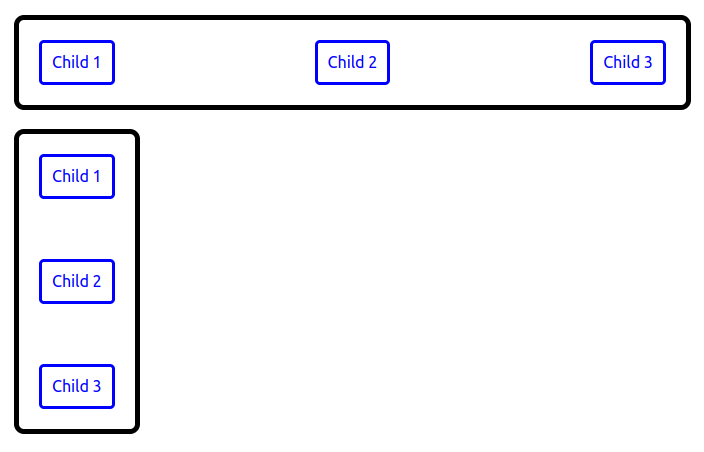

# react-margin-between

[](https://www.npmjs.com/package/react-margin-between)


1. [Summary](#summary)
1. [Installation](#installation)
1. [Usage](#usage)
1. [Developing](#developing)

## Summary
This is a React library that will add margins in between child elements, without adding margins to the outer edges of the children.
## Installation
```
yarn add react-margin-between
```
or
```
npm install react-margin-between --save
```
## Usage
See the `example` folder for a full example.

Import the package:
```
import MarginBetween from 'react-margin-between';
```

Horizontal example:
```
<div style={{ display: 'flex', flexDirection: 'row' }}>
  <MarginBetween marginHorizontal="1em">
    <div>Child 1</div>
    <div>Child 2</div>
    <div>Child 3</div>
  </MarginBetween>
</div>
```

Vertical example:
```
<div style={{ display: 'flex', flexDirection: 'column' }}>
  <MarginBetween marginVertical="1em">
    <div>Child 1</div>
    <div>Child 2</div>
    <div>Child 3</div>
  </MarginBetween>
</div>
```

Screenshot of the `example` project:



## Developing
1. Clone the project
1. Run `yarn start` in the root directory
1. Run `yarn start` in the `example` directory
1. Changes made to the code should be reflected in realtime in the browser
1. Run `yarn test` to run all the tests once the code changes are made
